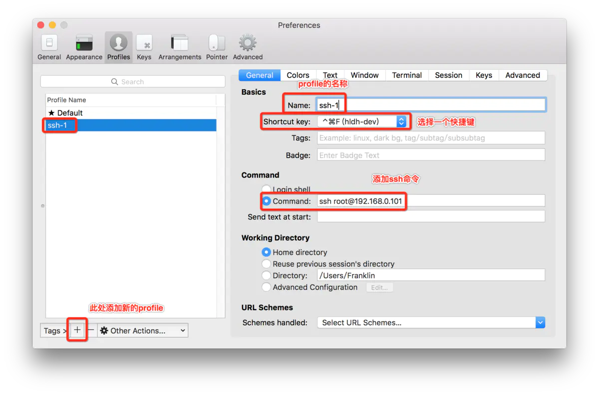
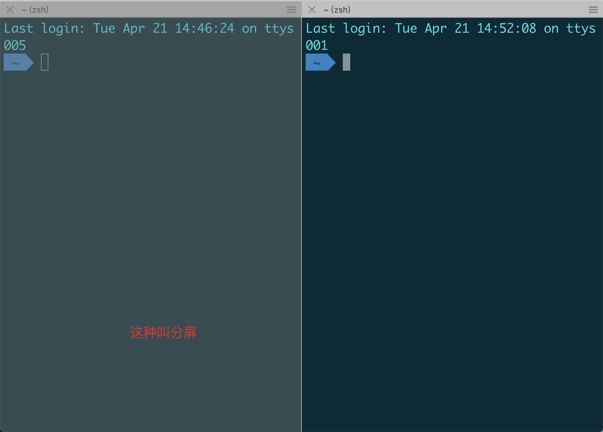
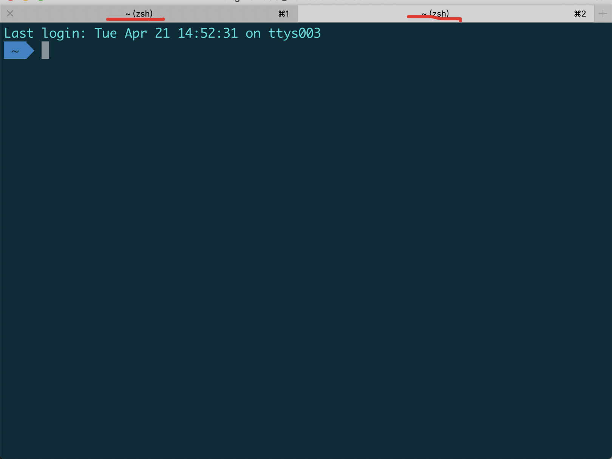

# iTerm2

mac系统下的一款非常好用的终端工具，它比系统自带的 Terminal 好用得多。有丰富的特色功能供，比如快捷键、分屏、定制终端主题颜色等；这些功能极大的提高我们敲命令的效率，强烈推荐每一个程序员都尝试和习惯使用这款工具。

下面介绍iTerm2的一些常用配置。

**1.启动一个连接到远程server的终端：**

选择 “Preferences->Profiles”，新增一个profile，并设置启动的快捷键和 command 命令，如图：

之后连接远程 server，再也不用每次输入ssh命令了，只需要敲快捷键 “^+cmd+F”，就能调出一个自动连接终端的快捷键了。非常方便！

**分屏：command+D**

  

 **多tab：command+t**

 别的后面补充。看上面两个大佬的连接应该可以学习到很多实用技巧。工欲善其事，必先利其器，有必要花时间折腾一下的。

 

# MAC iterm2 常用快捷键大全

**标签**

·    新建标签：command + t

·    关闭标签：command + w

·    切换标签：command + 数字 / command + 左右方向键

·    切换全屏：command + enter

·    查找：command + f

**分屏**

·    垂直分屏：command + d

·    水平分屏：command + shift + d

·    切换屏幕：command + option + 方向键 command + [ 或 command + ]

·    查看历史命令：command + ;

·    查看剪贴板历史：command + shift + h

**其他**

·    清除当前行：ctrl + u

·    到行首：ctrl + a

·    到行尾：ctrl + e

·    前进后退：ctrl + f/b (相当于左右方向键)

·    上一条命令：ctrl + p

·    搜索命令历史：ctrl + r

·    删除当前光标的字符：ctrl + d

·    删除光标之前的字符：ctrl + h

·    删除光标之前的单词：ctrl + w

·    删除到文本末尾：ctrl + k

·    交换光标处文本：ctrl + t

·    清屏1：command + r

·    清屏2：ctrl + l

 